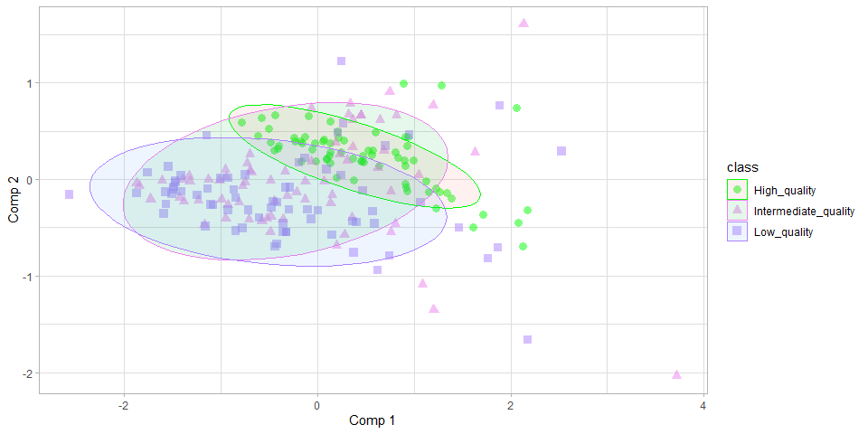
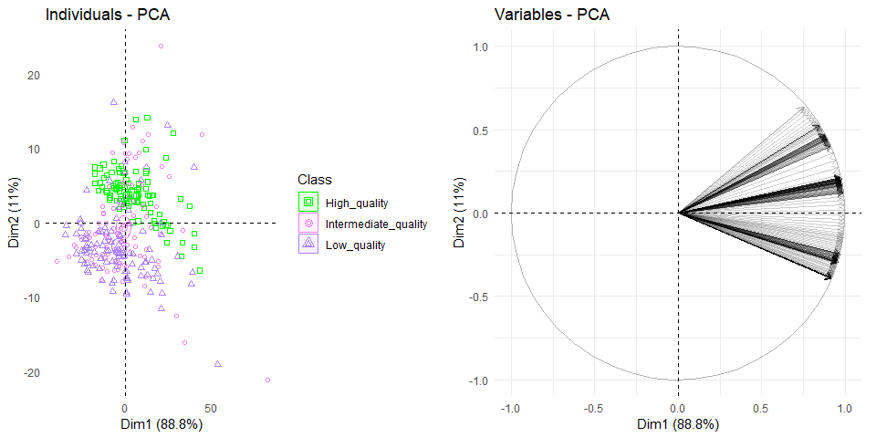

<!-- badges: start -->

<!-- badges: end -->
`nira`: Near-infrared data analysis
===================================

*Last update: 08.10.2020*

*Author: M.Sc André Dantas de Medeiros (Universidade Federal de viçosa).
Email:
<a href="mailto:andre.d.medeiros@ufv.br" class="email">andre.d.medeiros@ufv.br</a>*

> This package uses functions developed from the following packages:
> `pls, prospectr, dplyr, reshape2, ggplot2, ggpubr, factoextra,  FactoMineR, readxl, plyr, caret, e1071`.
> We thank the creators of these useful packages.

**Warning**:

-   The data structure must be in Dataframe format. Use the following
    command to transform it into a dataframe: `as.data.frame()`.

-   The last column must contain the response variable in `factor`
    or`character` format.

-   The package is under development and was made for the specific needs
    of our laboratory.

Installation and loading
------------------------

-   install the latest version from
    [GitHub](https://github.com/admedeiros/nira) as follow:

<!-- -->

    #Install
    if(!require(devtools)) install.packages("devtools")
    if(!require(nira)) devtools::install_github("admedeiros/nira")

    #Load package
    library(nira)

For package update
------------------

    if(!require(devtools)) install.packages("devtools")
    if(require(nira)) remove.packages("nira")
    .rs.restartR()
    if(!require(nira)) devtools::install_github("admedeiros/nira")
    #Load package
    library(nira)

Main functions:
---------------

`import_csv()`: Import and merge CSV NIR files

`plotmean_df()`: Create graphics with the average of the spectra class.

`plotraw_df()`: Create graphics with the raw of the spectra class.

`center_df()`: Center the data on the average.

`autoscaling_df()`: Autoscaling the data using the Z-score
transformation.

`snv_df()`: Standard Normal Variate (SNV) on near-infrared (NIR) data.

`msc_df()`: Multiplicative Scatter Correction (MSC) on near-infrared
(NIR) data.

`der_df()`: Applying derivatives with Savitzky-Golay smoothing..

`pca_df()`: Plots a graph of the principal component analysis.

`classification_df()`: Function to develop classification models

`load_classifier_df()`: Function to load and apply classifier created
with the classification\_df function

`prediction_df_df()`: Function to apply the classifier to new data
without labels

<!-- -->

Examples
--------

### Spectra Visualization

    library(nira)
    library(ggpubr) #for ggarrange
    # raw spectra
    a<-plotraw_df(nir_seed)
    # mean spectra per class
    b<-plotmean_df(nir_seed)
    # center
    c<-plotraw_df(center_df(nir_seed))
    d<-plotmean_df(center_df(nir_seed))
    # Autoscaling
    e<-plotraw_df(autoscaling_df(nir_seed))
    f<-plotmean_df(autoscaling_df(nir_seed))
    # SNV
    g<-plotraw_df(snv_df(nir_seed))
    h<-plotmean_df(snv_df(nir_seed))
    # MSC
    i<-plotraw_df(msc_df(nir_seed))
    j<-plotmean_df(msc_df(nir_seed))
    # 1st derivative with Savitzky-Golay smoothing
    k<-plotraw_df(der_SG(nir_seed,1))
    l<-plotmean_df(der_SG(nir_seed,1))
    # 2nd derivative with Savitzky-Golay smoothing
    m<-plotraw_df(der_SG(nir_seed,2))
    n<-plotmean_df(der_SG(nir_seed,2))

    ggarrange(a, b,c,d,e,f,g,h,i,j,k,l,m,n,
      labels = c("Raw spectra", "Mean spectra", "Center", "Center","Autoscaling","Autoscaling","SNV","SNV","MSC", "MSC","1st derivative", "1st derivative", "2nd derivative", "2nd derivative" ),
      ncol = 2, nrow = 7)

<!-- -->

### View of the exploratory principal component analysis

    pca_df(nir_seed,1,2)

<!-- -->

### Classification

    data(nir_seed)
    classification<-classification_df(nir_seed,metrics = 2)

    ## Warning in nominalTrainWorkflow(x = x, y = y, wts = weights, info = trainInfo, :
    ## There were missing values in resampled performance measures.

##### Cross-validation

    classification$`Cross-validation`

    ## Partial Least Squares 
    ## 
    ## 210 samples
    ## 312 predictors
    ##   3 classes: 'High_quality', 'Intermediate_quality', 'Low_quality' 
    ## 
    ## No pre-processing
    ## Resampling: Cross-Validated (10 fold, repeated 3 times) 
    ## Summary of sample sizes: 189, 189, 189, 189, 189, 189, ... 
    ## Resampling results across tuning parameters:
    ## 
    ##   ncomp  logLoss    AUC        prAUC      Accuracy   Kappa      Mean_F1  
    ##    1     1.0659706  0.6503401  0.4292712  0.4650794  0.1976190        NaN
    ##    2     1.0266903  0.7137188  0.4718326  0.5952381  0.3928571  0.5609619
    ##    3     0.9235199  0.8267574  0.5867059  0.6285714  0.4428571  0.5957456
    ##    4     0.8862659  0.8396825  0.6121077  0.6666667  0.5000000  0.6461700
    ##    5     0.8254675  0.9018141  0.6930179  0.7761905  0.6642857  0.7666811
    ##    6     0.7982458  0.9240363  0.7366469  0.7952381  0.6928571  0.7891360
    ##    7     0.7491364  0.9557823  0.7852269  0.8761905  0.8142857  0.8730127
    ##    8     0.7309549  0.9699546  0.8073060  0.8904762  0.8357143  0.8879721
    ##    9     0.7056253  0.9797052  0.8254200  0.9015873  0.8523810  0.8999919
    ##   10     0.6879264  0.9858277  0.8337702  0.9317460  0.8976190  0.9304002
    ##   Mean_Sensitivity  Mean_Specificity  Mean_Pos_Pred_Value  Mean_Neg_Pred_Value
    ##   0.4650794         0.7325397               NaN            0.7591309          
    ##   0.5952381         0.7976190         0.5715248            0.8422302          
    ##   0.6285714         0.8142857         0.6160619            0.8359405          
    ##   0.6666667         0.8333333         0.6617188            0.8451206          
    ##   0.7761905         0.8880952         0.7884099            0.8958894          
    ##   0.7952381         0.8976190         0.8036552            0.9033291          
    ##   0.8761905         0.9380952         0.8847002            0.9417733          
    ##   0.8904762         0.9452381         0.8981834            0.9484829          
    ##   0.9015873         0.9507937         0.9072046            0.9531868          
    ##   0.9317460         0.9658730         0.9393342            0.9684278          
    ##   Mean_Precision  Mean_Recall  Mean_Detection_Rate  Mean_Balanced_Accuracy
    ##         NaN       0.4650794    0.1550265            0.5988095             
    ##   0.5715248       0.5952381    0.1984127            0.6964286             
    ##   0.6160619       0.6285714    0.2095238            0.7214286             
    ##   0.6617188       0.6666667    0.2222222            0.7500000             
    ##   0.7884099       0.7761905    0.2587302            0.8321429             
    ##   0.8036552       0.7952381    0.2650794            0.8464286             
    ##   0.8847002       0.8761905    0.2920635            0.9071429             
    ##   0.8981834       0.8904762    0.2968254            0.9178571             
    ##   0.9072046       0.9015873    0.3005291            0.9261905             
    ##   0.9393342       0.9317460    0.3105820            0.9488095             
    ## 
    ## Accuracy was used to select the optimal model using the largest value.
    ## The final value used for the model was ncomp = 10.

##### Train results

    classification$Training_results

    ##               Accuracy                  Kappa                Mean_F1 
    ##              0.9666667              0.9500000              0.9665198 
    ##       Mean_Sensitivity       Mean_Specificity    Mean_Pos_Pred_Value 
    ##              0.9666667              0.9833333              0.9668364 
    ##    Mean_Neg_Pred_Value         Mean_Precision            Mean_Recall 
    ##              0.9835141              0.9668364              0.9666667 
    ##    Mean_Detection_Rate Mean_Balanced_Accuracy 
    ##              0.3222222              0.9750000

##### Test results

    classification$Testing_results

    ##               Accuracy                  Kappa                Mean_F1 
    ##              0.9777778              0.9666667              0.9777778 
    ##       Mean_Sensitivity       Mean_Specificity    Mean_Pos_Pred_Value 
    ##              0.9777778              0.9888889              0.9777778 
    ##    Mean_Neg_Pred_Value         Mean_Precision            Mean_Recall 
    ##              0.9888889              0.9777778              0.9777778 
    ##    Mean_Detection_Rate Mean_Balanced_Accuracy 
    ##              0.3259259              0.9833333

##### PLS-DA Plot

    classification$plsplot

<!-- -->

##### Variable importance

    classification$`Variable importance`

    ## kernelpls variable importance
    ## 
    ##   variables are sorted by maximum importance across the classes
    ##   only 20 most important variables shown (out of 312)
    ## 
    ##             High_quality Intermediate_quality Low_quality
    ## 2499.019759       21.486                86.56      100.00
    ## 2487.033849       19.938                41.06       65.81
    ## 2103.637378        6.449                51.50       38.96
    ## 2095.137688        5.984                49.68       37.92
    ## 2475.162977       16.837                31.14       47.99
    ## 2086.706843        5.483                45.98       35.71
    ## 1362.803133        3.437                45.85       35.52
    ## 2112.206314        6.868                42.66       32.62
    ## 2078.343145        4.991                41.36       33.61
    ## 1902.923499        4.935                38.93       27.27
    ## 2463.404282       13.069                23.00       38.33
    ## 2330.546543        4.119                37.15       25.30
    ## 2120.844894        7.765                34.00       28.34
    ## 2201.896273        2.391                32.73       26.82
    ## 2070.046224        4.823                32.71       29.98
    ## 2451.756782       10.717                19.10       32.30
    ## 1198.95178         1.572                32.30       16.21
    ## 2005.983045        2.132                32.03       21.53
    ## 2211.286184        1.471                31.99       24.44
    ## 2320.118864        3.536                31.90       19.19

### Load the pre-trained model and validate their performance in external labeled data

    data(nir_seed)
    load_classifier_df(nir_seed)

    ## Confusion Matrix and Statistics
    ## 
    ##                       
    ## previsoes              High_quality Intermediate_quality Low_quality
    ##   High_quality                  100                    1           0
    ##   Intermediate_quality            0                   94           3
    ##   Low_quality                     0                    5          97
    ## 
    ## Overall Statistics
    ##                                           
    ##                Accuracy : 0.97            
    ##                  95% CI : (0.9438, 0.9862)
    ##     No Information Rate : 0.3333          
    ##     P-Value [Acc > NIR] : < 2.2e-16       
    ##                                           
    ##                   Kappa : 0.955           
    ##                                           
    ##  Mcnemar's Test P-Value : NA              
    ## 
    ## Statistics by Class:
    ## 
    ##                      Class: High_quality Class: Intermediate_quality
    ## Sensitivity                       1.0000                      0.9400
    ## Specificity                       0.9950                      0.9850
    ## Pos Pred Value                    0.9901                      0.9691
    ## Neg Pred Value                    1.0000                      0.9704
    ## Prevalence                        0.3333                      0.3333
    ## Detection Rate                    0.3333                      0.3133
    ## Detection Prevalence              0.3367                      0.3233
    ## Balanced Accuracy                 0.9975                      0.9625
    ##                      Class: Low_quality
    ## Sensitivity                      0.9700
    ## Specificity                      0.9750
    ## Pos Pred Value                   0.9510
    ## Neg Pred Value                   0.9848
    ## Prevalence                       0.3333
    ## Detection Rate                   0.3233
    ## Detection Prevalence             0.3400
    ## Balanced Accuracy                0.9725

### Load the pre-trained model and use on data without labeling

    data(nir_seed)
    pc<-prediction_df(nir_seed[,-313])
    pca_df(pc)

<!-- -->
