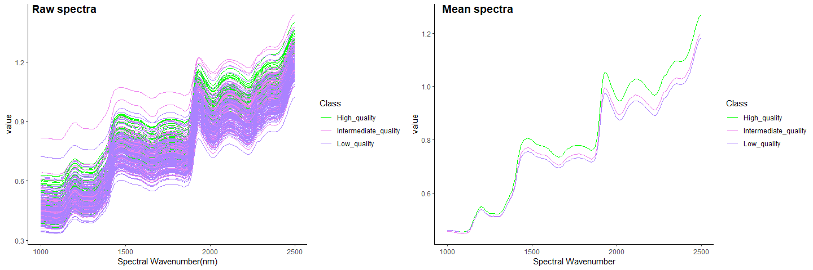
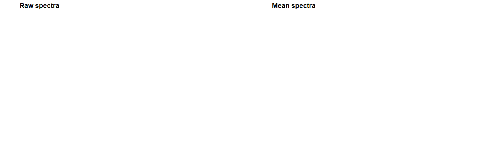
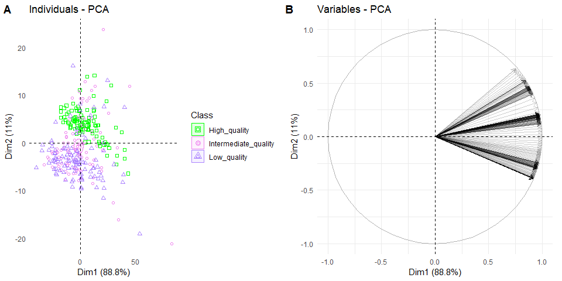
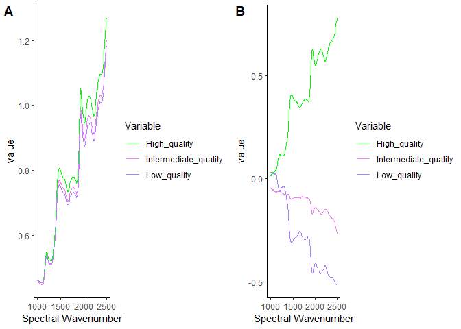
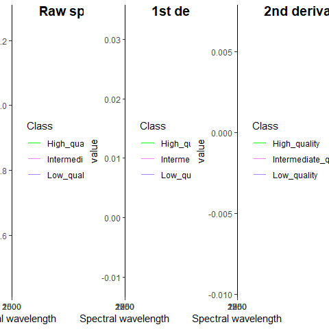

<<<<<<< HEAD
# niradm-package: Analysis and graphs of near-infrared
=======
# niradm-package: Analysis and graphs of near-infrared spectra
>>>>>>> 006663f50bfadcc6a1079b4dd3f6924840d14611

## Installation and loading

  - install the latest version from
    [GitHub](https://github.com/admedeiros/niradm-package) as follow:

<!-- end list -->

``` r
#Install
if(!require(devtools)) install.packages("devtools")
```

    ## Loading required package: devtools

    ## Loading required package: usethis

``` r
if(!require(niradm)) devtools::install_github("admedeiros/niradm-package")
```

    ## Loading required package: niradm

``` r
#Load package
library(niradm)
```

## Examples

### Spectra Visualization

``` r
# raw spectra
vizplotraw(nir_seed)
```

<!-- -->

``` r
# mean spectra per class
vizplotmean(nir_seed)
```

<!-- --> \#\#\# View
of the exploratory principal component analysis

``` r
pca(nir_seed,1,2)
```

<!-- -->

### Autoscaling and center

``` r
library(ggpubr) #for ggarrange
```

    ## Loading required package: ggplot2

``` r
data(nir_seed)
dados<-scale_center(nir_seed)
a<-vizplotmean(nir_seed)
b<-vizplotmean(dados)
ggarrange(a, b,
labels = c("A", "B"),
ncol = 2, nrow = 1)
```

<!-- -->

### Applying derivatives with Savitzky-Golay smoothing

``` r
data(nir_seed)
a<-vizplotmean(nir_seed)

#Applying 1st derivative with Savitzky-Golay smoothing.
dados<-der_SG(nir_seed,1,2,11)
b<-vizplotmean(dados)

#Applying 2nd derivative with Savitzky-Golay smoothing.
dados<-der_SG(nir_seed,2,2,11)
c<-vizplotmean(dados)
ggarrange(a, b, c, 
labels = c("A", "B", "C"),
ncol = 2, nrow = 2,  widths = 15,
  heights = 10)
```

<!-- -->
